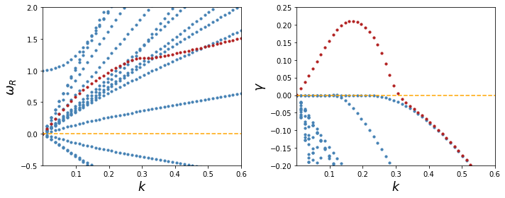

### Bump-on-tail instability

```python
# %matplotlib inline
import matplotlib.pyplot as plt
import numpy as np
plt.rcParams['axes.labelsize'] = 'xx-large'

import sys
sys.path.append('/path/to/xeon')
import xeon
from xeon.common import plot_dr

# specify parameters of the background and beam electron species
species = np.array([
    # q, m, n,   v,     p
    [-1, 1, 0.9, 0,     0.9],
    [-1, 1, 0.1, 7.071, 0.1],
])
# specify other parameters
params = dict(epsilon0=1)
# Order of Pade approximation
J = 8
# an array of wavenumbers
ks = np.linspace(0.0001, 0.6, 50)
# for each wavenumber, compute the complex frequencies
ws = xeon.vlasov.k2w_es1d(ks, species, params, J=J, sort='imag')

# plot the dispersion relations
fig, axs = plt.subplots(1, 2, figsize=(10, 4), sharex=True)
plot_dr(
    ks,
    ws[:, :-1],
    ax0=axs[0],
    ax1=axs[1],
    pargs0=dict(c='steelblue', s=10),
    pargs1=dict(c='steelblue', s=10),
)
plot_dr(
    ks,
    ws[:, -1:],
    ax0=axs[0],
    ax1=axs[1],
    pargs0=dict(c='firebrick', s=10),
    pargs1=dict(c='firebrick', s=10),
)
axs[0].axhline(0, ls='--', c='orange')
axs[1].axhline(0, ls='--', c='orange')
axs[1].set_ylim(-0.2, 0.25)
axs[0].set_ylim(-0.5, 2)
fig.tight_layout()
```



